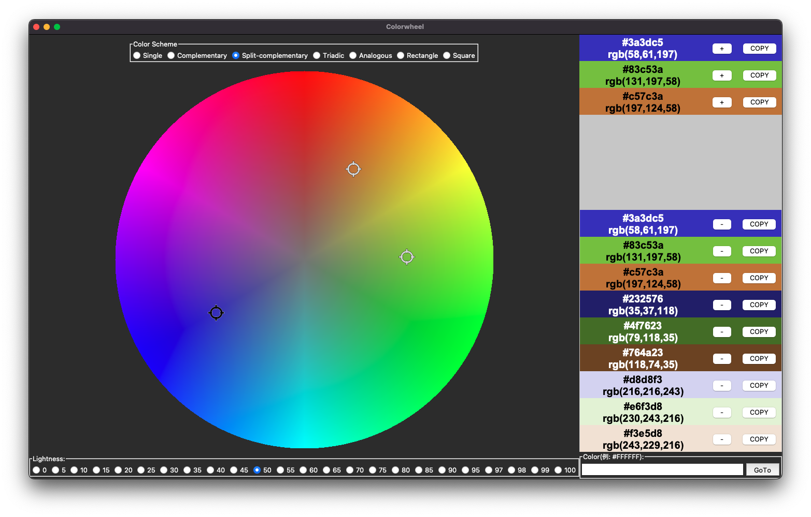

# Color-Wheel

 A colorwheel selector demo tool built with Tkinter

<!-- ## 使い方

以下を実行すると、カラーホイール画面が表示されます。

~~~shell
poetry run python3 color_wheel.py
~~~ -->

## Usage

run the following command:

~~~shell
poetry run python3 color_wheel.py
~~~

### Features

- Display the color(s) selected by the cursor(s) in the top right corner of the screen
- Add (or Delete) cursors when radio button is changed in "Color Scheme"
- Change brightness of the color wheel when brightness slider has changed
- Copy the color to the bottom right corner of the screen when the "+" button of the color in the upper right corner of the screen has pressed
- Delete the color from the bottom right corner of the screen when the "-" button of the copied color has pressed
- Copy the RGB hex value (e.g. #000000) to the clipboard when "COPY" button of any colors pressed

### Cursor Type

- main cursor

  Select a color by dragging or double clicking.
  The selected color is displayed at the top right corner of the screen.

  

- sub cursor

  This is a cursor that is added according to the selected **Color Scheme** radio button.
  It moves automatically according to the position of the main cursor.
  The selected color is displayed after the first one in the top right corner of the screen.

  
